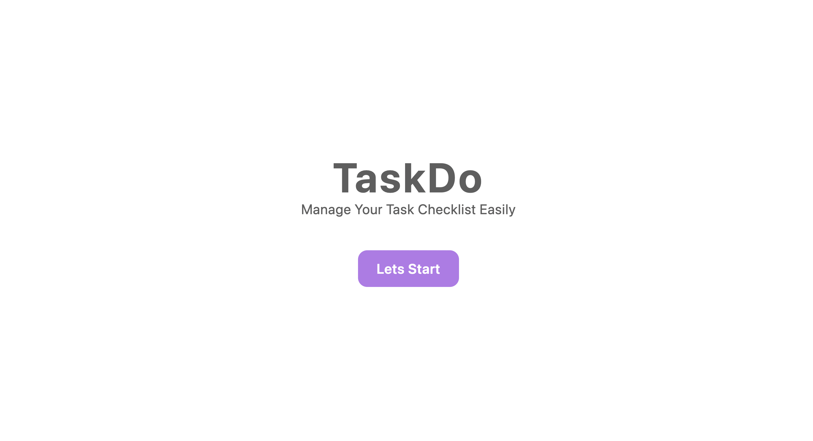
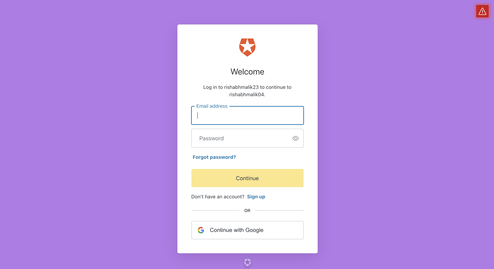
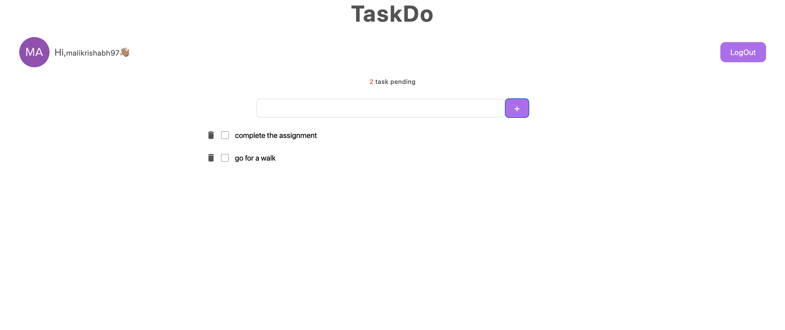
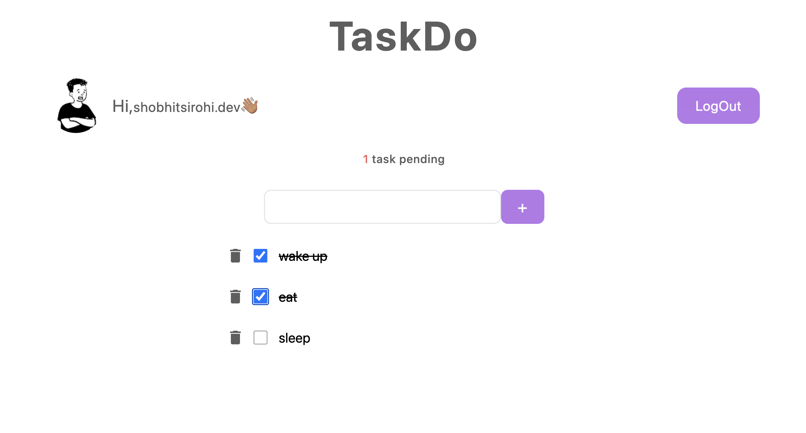

<!-- values -->

<h1 align="center">TaskDo</h1>

  <h3>
    <a href="https://nervous-carson-5d2987.netlify.app/">
      Demo
    </a>
  </h3>

<!-- overview -->

<!-- Built with -->

### Built With

- React
- TailwindCss
- Auth0(OAuth2.0)
- Typescript

<!-- instruction -->

## How to run TaskDo

- Step1: Click Lets Start button to open the login window(Auth0).

- Step2: Login/Sign up with your credentials.

- Step3: Now write your task and click the + Button to Add your task to the List.

- Step4: You can click the checkbox to mark the task complete.

- Step5: After completing the task you can delete them from the list by clicking the bin icon.

- Step6: After completing your all tasks you can Logout.

<!-- additional information -->

- Note: User can logout and login again, but the data won't be lost as it is saved locally.
